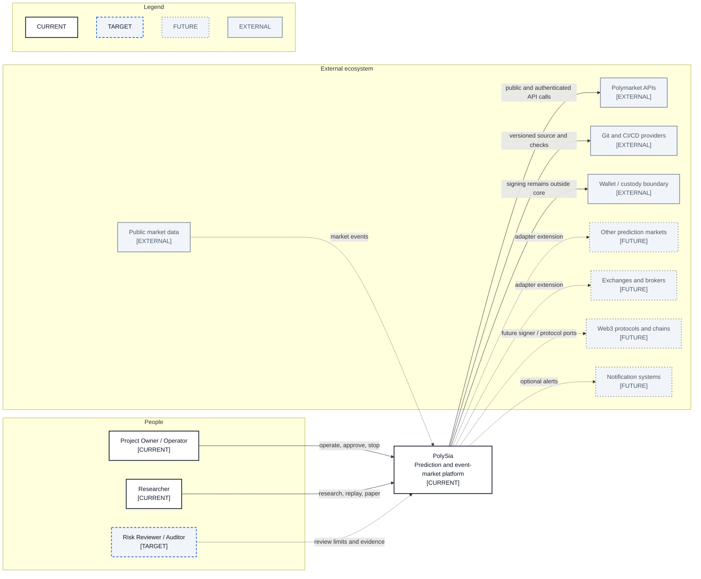

# System Landscape

- **Diagram ID:** PSA-ARCH-01
- **Purpose:** Place PolySia in its broader human, venue, custody, data, and delivery ecosystem.
- **Scope:** PolySia as one system and the external actors/systems around it; internal components are intentionally hidden.
- **Architecture status:** MIXED
- **Audience:** Project owner, developers, reviewers, and future auditors.
- **Source commit:** `44a8ae0fbccd0de916a0621236ea5931e7c3a256`

## Mermaid diagram

Canonical source: [`01-system-landscape.mmd`](../sources/01-system-landscape.mmd)

## Legend

CURRENT is solid, TARGET is dashed, FUTURE is dotted, EXTERNAL is gray, safety is amber, emergency/block is red, and approval/healthy is green. Arrow meanings follow [diagram conventions](../diagram-conventions.md).

## Main reading path

Read from people to PolySia, then from PolySia to current external dependencies and optional future ecosystems.

## Current implementation mapping

PolySia is implemented under `src/polysia/`; the operator surface is `src/polysia/cli.py`; the current venue boundary is `src/polysia/adapters/polymarket/`; CI configuration is `.github/workflows/ci.yml`.

## Target/future elements

Risk reviewer/auditor interaction is TARGET. Additional prediction markets, exchanges, brokers, Web3 protocols/chains, and notifications are FUTURE.

## Related repository files

`src/polysia/`, `src/polysia/cli.py`, `src/polysia/adapters/polymarket/`, `.github/workflows/ci.yml`, `docs/22-roadmap/roadmap.md`

## Related tests

`tests/migration/test_identity.py`, `tests/architecture/test_boundaries.py`, `tests/contract/test_polymarket_sdk_surface.py`

## Related ADRs

ADR-0001, ADR-0002, ADR-0004, ADR-0007, ADR-0008

## Related capabilities/requirements

CAP-001–CAP-012; REQ-001–REQ-007

## Assumptions

The owner/operator and researcher are current roles; custody remains outside the PolySia core.

## Known limitations

External future systems are capability categories, not selected vendors or release commitments.

## Review trigger

A new user role, venue, custody model, notification integration, or CI ownership model is approved.
