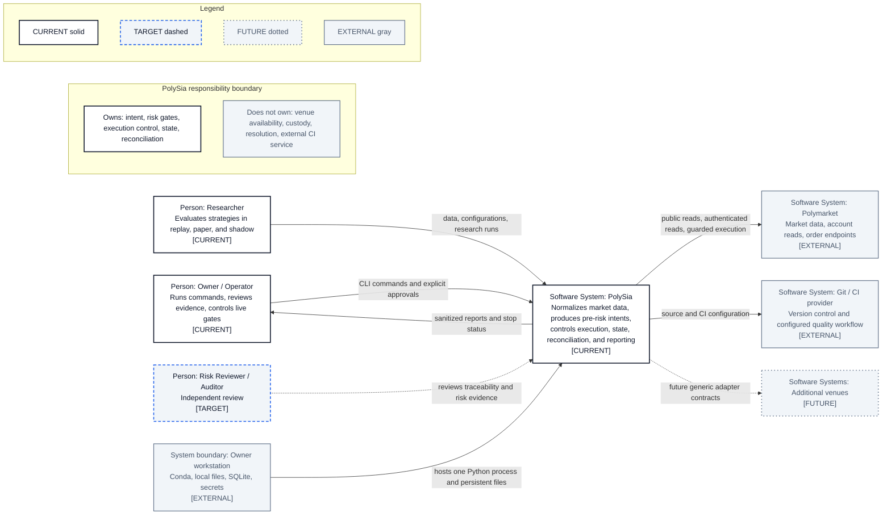

# C4 System Context

- **Diagram ID:** PSA-ARCH-02
- **Purpose:** Explain in one view who uses PolySia, what it owns, and which responsibilities remain external.
- **Scope:** C4 Person and Software System level only.
- **Architecture status:** MIXED
- **Audience:** Non-technical owner, developers, risk reviewers, and architecture reviewers.
- **Source commit:** `449f1c308fc74bd2a541e0e905f281fd19e5cd9b`

## Mermaid diagram

Canonical source: [`02-c4-system-context.mmd`](../sources/02-c4-system-context.mmd)

## Legend

CURRENT is solid, TARGET is dashed, FUTURE is dotted, EXTERNAL is gray, safety is amber, emergency/block is red, and approval/healthy is green. Arrow meanings follow [diagram conventions](../diagram-conventions.md).

## Main reading path

Start with the owner and researcher, then PolySia, then Polymarket, the workstation, Git/CI, and future venue systems.

## Current implementation mapping

The `polysia` package owns normalization, intent generation, risk gating, execution control, state, reconciliation, and reports. Polymarket availability, custody, market resolution, and external CI service operation remain external.

## Target/future elements

An independent reviewer role and additional venue systems are TARGET/FUTURE.

## Related repository files

`README.md`, `pyproject.toml`, `src/polysia/`, `docs/00-governance/project-charter.md`

## Related tests

`tests/migration/test_identity.py`, `tests/integration/test_paper_vertical_slice.py`, `tests/architecture/test_boundaries.py`

## Related ADRs

ADR-0001, ADR-0002, ADR-0004, ADR-0008

## Related capabilities/requirements

CAP-001–CAP-012; REQ-002, REQ-003, REQ-004, REQ-006

## Assumptions

Logical responsibility is more important here than Python package detail.

## Known limitations

This view does not show internal safety gates or deployment topology.

## Review trigger

PolySia assumes a new external responsibility or communicates with a new system.
