# C4 Container View — Current

- **Diagram ID:** PSA-ARCH-03
- **Purpose:** Show the current modular-monolith runtime honestly at logical container level.
- **Scope:** Logical containers inside one deployable Python package/process; these are not independently deployed services.
- **Architecture status:** CURRENT
- **Audience:** Developers, owner, maintainers, and architecture reviewers.
- **Source commit:** `44a8ae0fbccd0de916a0621236ea5931e7c3a256`

## Mermaid diagram

Canonical source: [`03-c4-container-current.mmd`](../sources/03-c4-container-current.mmd)

```mermaid
flowchart LR
  Actor["Person: Owner / Researcher\n[CURRENT]"]:::current
  Venue["External System: Polymarket APIs\n[EXTERNAL]"]:::external
  DB[("SQLite / local files\n[CURRENT]")]:::storage

  subgraph PS["Software System: PolySia — one deployable Python modular monolith [CURRENT]"]
    CLI["Container: CLI and Safe Output\nTyper commands, parsing, redaction"]:::application
    Config["Container: Configuration and Safety Defaults\nDATA_ONLY / PAPER / gated LIVE"]:::risk

    subgraph DATA["Market-data path"]
      Adapter["Container: Polymarket Adapter\npublic, stream, secure, mapping, geoblock"]:::adapter
      Bus["Container: Events and In-Memory Bus\nnormalized market events"]:::data
      Book["Container: Order Book and Features\nDecimal book, microstructure"]:::data
    end

    subgraph DECISION["Decision and control"]
      DomainPorts["Container: Domain Models and Application Ports\nvenue-neutral contracts"]:::domain
      Strategies["Container: Strategy Framework\nstale-price, passive market maker"]:::strategy
      Risk["Container: Independent Risk and Kill Switch\napprove, reduce, reject, stop"]:::risk
    end

    subgraph STATE["Execution and state"]
      Execution["Container: Execution\npaper broker and guarded live broker"]:::execution
      Portfolio["Container: Positions and P&L\noperational ledger"]:::portfolio
      Storage["Container: Storage Repositories\nSQLite repositories"]:::storage
      Recon["Container: Reconciliation and Safety Pause\ninternal vs external"]:::risk
    end

    Ops["Container: Monitoring, Backtesting, Deployment\nreports, replay, readiness, handoff"]:::observability
  end

  Actor -->|commands| CLI
  CLI --> Config
  CLI --> Ops
  CLI --> Adapter
  Adapter -.->|normalized events| Bus
  Bus -.-> Book
  Book --> Strategies
  DomainPorts --> Strategies
  Strategies -->|OrderIntent| Risk
  Config --> Risk
  Risk -->|ApprovedOrderIntent| Execution
  Risk -->|reject / kill| CLI
  Execution --> Adapter
  Adapter -->|API calls| Venue
  Execution ==>|fills / state update| Portfolio
  Portfolio ==>|state| Storage
  Bus ==>|events| Storage
  Adapter -.->|account and order state| Recon
  Portfolio --> Recon
  Recon -->|safety pause| Risk
  Recon --> Ops
  Storage ==>|persistent records| DB
  Ops --> CLI

  subgraph LEGEND["Legend"]
    L1["CURRENT logical container"]:::current
    L2["EXTERNAL"]:::external
    L3["SAFETY"]:::risk
    L4["Persistent update ==>"]:::storage
  end

  classDef current fill:#FFFFFF,stroke:#0F172A,stroke-width:2px,color:#0F172A;
  classDef external fill:#F1F5F9,stroke:#64748B,stroke-width:1.5px,color:#475569;
  classDef domain fill:#FFFFFF,stroke:#0F766E,stroke-width:2px,color:#0F172A;
  classDef application fill:#FFFFFF,stroke:#2563EB,stroke-width:2px,color:#0F172A;
  classDef strategy fill:#FFFFFF,stroke:#7C3AED,stroke-width:2px,color:#0F172A;
  classDef portfolio fill:#FFFFFF,stroke:#1D4ED8,stroke-width:2px,color:#0F172A;
  classDef risk fill:#FFF7ED,stroke:#D97706,stroke-width:2px,color:#0F172A;
  classDef execution fill:#FFFFFF,stroke:#0891B2,stroke-width:2px,color:#0F172A;
  classDef adapter fill:#FFFFFF,stroke:#4F46E5,stroke-width:2px,color:#0F172A;
  classDef data fill:#FFFFFF,stroke:#0D9488,stroke-width:2px,color:#0F172A;
  classDef storage fill:#FFFFFF,stroke:#475569,stroke-width:2px,color:#0F172A;
  classDef observability fill:#FFFFFF,stroke:#9333EA,stroke-width:2px,color:#0F172A;
```

## Legend

CURRENT is solid, TARGET is dashed, FUTURE is dotted, EXTERNAL is gray, safety is amber, emergency/block is red, and approval/healthy is green. Arrow meanings follow [diagram conventions](../diagram-conventions.md).

## Main reading path

Follow operator commands into data ingestion, decisions and risk, execution/state, reconciliation, and operator output.

## Current implementation mapping

Every container maps to current packages: CLI/support, config, adapter, bus, orderbook/features, domain/ports, strategies, risk, execution, portfolio, storage, reconciliation, monitoring/backtesting/deployment.

## Target/future elements

No target container is claimed. OMS and orchestration are deliberately absent from this current view.

## Related repository files

`src/polysia/cli.py`, `src/polysia/cli_support/`, `src/polysia/config/`, `src/polysia/domain/`, `src/polysia/application/`, `src/polysia/adapters/`, `src/polysia/bus/`, `src/polysia/orderbook/`, `src/polysia/features/`, `src/polysia/strategies/`, `src/polysia/risk/`, `src/polysia/execution/`, `src/polysia/portfolio/`, `src/polysia/storage/`, `src/polysia/reconciliation/`, `src/polysia/monitoring/`

## Related tests

`tests/integration/test_paper_vertical_slice.py`, `tests/architecture/test_boundaries.py`, `tests/characterization/test_cli_contract.py`

## Related ADRs

ADR-0001, ADR-0002, ADR-0004, ADR-0006, ADR-0008

## Related capabilities/requirements

CAP-001–CAP-012; REQ-001, REQ-002, REQ-004, REQ-006

## Assumptions

A C4 container may be a logical runtime boundary within the single deployment.

## Known limitations

Application ports exist, but application services are empty and not universal runtime wiring.

## Review trigger

A package boundary changes, a new deployable is introduced, or a current logical container is materially decomposed.
