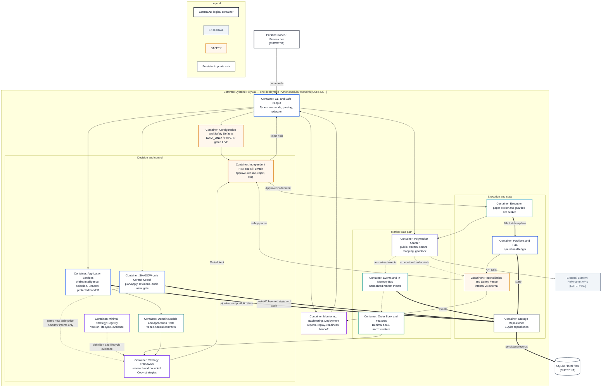

# C4 Container View — Current

- **Diagram ID:** PSA-ARCH-03
- **Purpose:** Show the current modular-monolith runtime honestly at logical container level.
- **Scope:** Logical containers inside one deployable Python package/process; these are not independently deployed services.
- **Architecture status:** CURRENT
- **Audience:** Developers, owner, maintainers, and architecture reviewers.
- **Source commit:** `8d64bb7bd5182bde5ed3a95c6ac26f7c859737a6`
- **Reviewed:** 2026-09-05

## Mermaid diagram

Canonical source: [`03-c4-container-current.mmd`](../sources/03-c4-container-current.mmd)

## Legend

CURRENT is solid, TARGET is dashed, FUTURE is dotted, EXTERNAL is gray, safety is amber, emergency/block is red, and approval/healthy is green. Arrow meanings follow [diagram conventions](../diagram-conventions.md).

## Main reading path

Follow operator commands into data ingestion, decisions and risk, execution/state, reconciliation, and operator output.

## Current implementation mapping

Every container maps to current packages: CLI composition/commands/support, config, adapter, bus,
orderbook/features, domain/ports and services, the bounded Strategy Registry, strategies,
the SHADOW-only Control Kernel, risk, execution, portfolio, storage,
reconciliation, and monitoring/backtesting/deployment. The Control Kernel gates
only new `stale-price@0.1.0` Shadow intents and cannot reach Live trading.

## Target/future elements

No target container is claimed. OMS and orchestration are deliberately absent from this current view.

## Related repository files

`src/polysia/cli.py`, `src/polysia/cli_commands/`,
`src/polysia/cli_support/`, `src/polysia/config/`, `src/polysia/domain/`,
`src/polysia/application/`, `src/polysia/adapters/`, `src/polysia/bus/`,
`src/polysia/orderbook/`, `src/polysia/features/`,
`src/polysia/strategies/`, `src/polysia/control/`, `src/polysia/risk/`,
`src/polysia/execution/`, `src/polysia/portfolio/`,
`src/polysia/storage/`, `src/polysia/reconciliation/`,
`src/polysia/monitoring/`

## Related tests

`tests/integration/test_paper_vertical_slice.py`,
`tests/integration/test_shadow_control_vertical_slice.py`,
`tests/unit/strategies/test_registry.py`,
`tests/architecture/test_boundaries.py`,
`tests/contract/test_cli_surface.py`

## Related ADRs

ADR-0001, ADR-0002, ADR-0004, ADR-0006, ADR-0008, ADR-0012

## Related capabilities/requirements

CAP-001–CAP-012; REQ-001, REQ-002, REQ-004, REQ-006

## Assumptions

A C4 container may be a logical runtime boundary within the single deployment.

## Known limitations

Application services cover Wallet Intelligence and Shadow orchestration. They
are not universal runtime wiring for every older CLI path.

## Review trigger

A package boundary changes, a new deployable is introduced, or a current logical container is materially decomposed.
