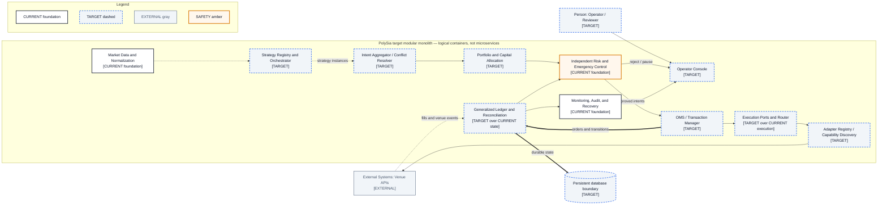

# C4 Container View — Target

- **Diagram ID:** PSA-ARCH-04
- **Purpose:** Show the approved modular-monolith evolution without implying microservices.
- **Scope:** Target logical containers for multi-strategy, portfolio, OMS, adapter discovery, generalized state, and operator control.
- **Architecture status:** TARGET
- **Audience:** Owner, architects, senior developers, risk reviewers, and roadmap reviewers.
- **Source commit:** `44a8ae0fbccd0de916a0621236ea5931e7c3a256`

## Mermaid diagram

Canonical source: [`04-c4-container-target.mmd`](../sources/04-c4-container-target.mmd)

## Legend

CURRENT is solid, TARGET is dashed, FUTURE is dotted, EXTERNAL is gray, safety is amber, emergency/block is red, and approval/healthy is green. Arrow meanings follow [diagram conventions](../diagram-conventions.md).

## Main reading path

Follow data into strategy orchestration, conflict resolution, capital allocation, independent risk, OMS, execution routing, adapters, ledger, and operations.

## Current implementation mapping

Current foundations are market data, risk/kill switch, execution services, state, reconciliation, and monitoring. They are not evidence that target orchestration/OMS components already exist.

## Target/future elements

Strategy registry/orchestrator, intent resolver, allocator, OMS/Transaction Manager, execution router, adapter registry, generalized ledger, operator console, and stronger database boundary are TARGET.

## Related repository files

`docs/00-governance/master-operating-charter.md`, `docs/22-roadmap/roadmap.md`, `src/polysia/domain/`, `src/polysia/application/ports/`

## Related tests

Current foundation evidence: `tests/architecture/test_boundaries.py`, `tests/integration/test_paper_vertical_slice.py`, `tests/property/test_risk_properties.py`

## Related ADRs

ADR-0002, ADR-0004, ADR-0006, ADR-0008

## Related capabilities/requirements

Current CAP-001–CAP-012; target direction from Charter §§24–32 and §59

## Assumptions

The modular monolith remains the default until measured deployment needs justify another ADR.

## Known limitations

Target containers have no implementation-path claims and no delivery dates.

## Review trigger

A target component receives an approved requirement, ADR, implementation, or retirement decision.
