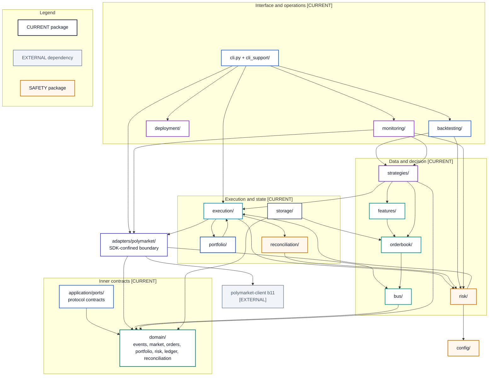

# Current Component Map

- **Diagram ID:** PSA-ARCH-05
- **Purpose:** Map real Python packages and the principal dependency relationships relevant to architecture.
- **Scope:** Top-level `src/polysia` packages; individual classes are shown in focused diagrams instead.
- **Architecture status:** CURRENT
- **Audience:** Developers, maintainers, reviewers, and onboarding engineers.
- **Source commit:** `44a8ae0fbccd0de916a0621236ea5931e7c3a256`

## Mermaid diagram

Canonical source: [`05-current-component-map.mmd`](../sources/05-current-component-map.mmd)

## Legend

CURRENT is solid, TARGET is dashed, FUTURE is dotted, EXTERNAL is gray, safety is amber, emergency/block is red, and approval/healthy is green. Arrow meanings follow [diagram conventions](../diagram-conventions.md).

## Main reading path

Read from interface/operations packages through data/decision and execution/state packages toward domain and adapter boundaries.

## Current implementation mapping

All boxes are real packages. The diagram highlights actual broad imports while the traceability register provides evidence and capability mapping.

## Target/future elements

No target package is shown. Known debt is documented in the module-dependency view.

## Related repository files

`src/polysia/`, `docs/04-architecture/module-decomposition.md`

## Related tests

`tests/architecture/test_boundaries.py`, `tests/architecture/test_module_decomposition.py`, `tests/characterization/test_cli_contract.py`

## Related ADRs

ADR-0001, ADR-0002, ADR-0004

## Related capabilities/requirements

CAP-001–CAP-012; REQ-002, REQ-006

## Assumptions

Principal edges are more useful than every individual import.

## Known limitations

The map is not a generated exhaustive import graph; it intentionally groups high-volume monitoring and CLI dependencies.

## Review trigger

A top-level package is added, removed, or changes architectural direction.
