# Multi-Strategy Target Architecture

- **Diagram ID:** PSA-ARCH-06
- **Purpose:** Make the safe extension model for concurrent strategy plug-ins immediately understandable.
- **Scope:** Current strategy plug-ins plus target registration, supervision, conflict resolution, capital allocation, OMS, routing, and feedback.
- **Architecture status:** MIXED
- **Audience:** Owner, architects, strategy developers, risk reviewers, and execution developers.
- **Source commit:** `44a8ae0fbccd0de916a0621236ea5931e7c3a256`

## Mermaid diagram

Canonical source: [`06-multi-strategy-target-architecture.mmd`](../sources/06-multi-strategy-target-architecture.mmd)

```mermaid
flowchart LR
  Market["Normalized Market Events\n[CURRENT]"]:::data
  Context["Read-only Market / Portfolio / Risk Context\n[TARGET contract]"]:::target

  subgraph CURRENTSTRAT["Strategy plug-ins"]
    Stale["StalePriceStrategy\n[CURRENT]"]:::strategy
    PMM["PassiveMarketMakerStrategy\n[CURRENT]"]:::strategy
    NewPlugin["New strategy plug-in\n[FUTURE]"]:::future
  end

  Registry["Strategy Registry\nidentity, version, activation, suspension, retirement\n[TARGET]"]:::target
  Orchestrator["Strategy Orchestrator\nschedule and supervise concurrent instances\n[TARGET]"]:::target
  Resolver["Intent Aggregator / Conflict Resolver\ndeduplicate and resolve correlated intents\n[TARGET]"]:::target
  Allocator["Portfolio and Capital Allocation\nreserve capital and enforce portfolio constraints\n[TARGET]"]:::target
  Risk["Independent Risk Engine\nfinal reject / reduce authority\n[CURRENT foundation]"]:::risk
  OMS["OMS / Transaction Manager\nidempotency, lifecycle, attribution\n[TARGET]"]:::target
  Exec["Generic Execution Port / Router\n[TARGET over CURRENT execution]"]:::target
  Adapter["Venue Adapter\nPolymarket CURRENT; others FUTURE"]:::adapter
  Venue["Venue\n[EXTERNAL]"]:::external
  Ledger["Positions / Generalized Ledger\n[CURRENT foundation + TARGET]"]:::portfolio
  Recon["Reconciliation and Safety Pause\n[CURRENT]"]:::risk
  Health["Strategy Health and Monitoring\n[TARGET over CURRENT monitoring]"]:::observability

  Market -.-> Orchestrator
  Registry --> Orchestrator
  Orchestrator -.-> Stale
  Orchestrator -.-> PMM
  Orchestrator -.-> NewPlugin
  Context -.-> Stale
  Context -.-> PMM
  Context -.-> NewPlugin
  Stale -->|pre-risk OrderIntent| Resolver
  PMM -->|pre-risk OrderIntent| Resolver
  NewPlugin -.->|pre-risk intent| Resolver
  Resolver --> Allocator
  Allocator --> Risk
  Risk -->|approved / reduced| OMS
  Risk -->|reject| Health
  OMS --> Exec
  Exec --> Adapter
  Adapter --> Venue
  Venue -.->|fills and order events| Ledger
  OMS ==>|expected order state| Ledger
  Ledger --> Recon
  Recon --> Risk
  Ledger -.-> Context
  Recon -.-> Health
  Health -.-> Registry

  subgraph GUARANTEE["Non-bypass guarantee"]
    G1["Strategy -> Resolver -> Allocator -> Risk -> OMS -> Execution -> Adapter"]:::safe
    G2["No Strategy -> Venue path"]:::danger
  end

  subgraph LEGEND["Legend"]
    L1["CURRENT solid"]:::current
    L2["TARGET dashed"]:::target
    L3["FUTURE dotted"]:::future
    L4["SAFETY amber / BLOCK red"]:::risk
  end

  classDef current fill:#FFFFFF,stroke:#0F172A,stroke-width:2px,color:#0F172A;
  classDef target fill:#F1F5F9,stroke:#2563EB,stroke-width:2px,stroke-dasharray:6 4,color:#0F172A;
  classDef future fill:#F1F5F9,stroke:#64748B,stroke-width:2px,stroke-dasharray:2 5,color:#475569;
  classDef external fill:#F1F5F9,stroke:#64748B,stroke-width:1.5px,color:#475569;
  classDef strategy fill:#FFFFFF,stroke:#7C3AED,stroke-width:2px,color:#0F172A;
  classDef data fill:#FFFFFF,stroke:#0D9488,stroke-width:2px,color:#0F172A;
  classDef portfolio fill:#EFF6FF,stroke:#1D4ED8,stroke-width:2px,color:#0F172A;
  classDef risk fill:#FFF7ED,stroke:#D97706,stroke-width:2.5px,color:#0F172A;
  classDef adapter fill:#FFFFFF,stroke:#4F46E5,stroke-width:2px,color:#0F172A;
  classDef observability fill:#FFFFFF,stroke:#9333EA,stroke-width:2px,color:#0F172A;
  classDef safe fill:#F0FDF4,stroke:#16A34A,stroke-width:2px,color:#0F172A;
  classDef danger fill:#FEF2F2,stroke:#DC2626,stroke-width:2.5px,color:#0F172A;
```

## Legend

CURRENT is solid, TARGET is dashed, FUTURE is dotted, EXTERNAL is gray, safety is amber, emergency/block is red, and approval/healthy is green. Arrow meanings follow [diagram conventions](../diagram-conventions.md).

## Main reading path

Follow market/context inputs to independent strategy instances, then through resolver, allocator, risk, OMS, execution, adapter, venue, ledger, reconciliation, and health feedback.

## Current implementation mapping

`BaseStrategy`, `StalePriceStrategy`, `PassiveMarketMakerStrategy`, `OrderIntent`, `RiskEngine`, execution services, position ledger, reconciliation, and monitoring are CURRENT foundations.

## Target/future elements

Registry, orchestrator, conflict resolver, allocator, OMS/Transaction Manager, generic router, and strategy lifecycle/health integration are TARGET. A new plug-in is FUTURE until implemented.

## Related repository files

`src/polysia/strategies/`, `src/polysia/domain/orders/`, `src/polysia/risk/`, `src/polysia/execution/`, `src/polysia/portfolio/`, `src/polysia/reconciliation/`, `docs/00-governance/master-operating-charter.md`

## Related tests

`tests/integration/test_paper_vertical_slice.py`, strategy unit tests, `tests/property/test_risk_properties.py`, `tests/architecture/test_boundaries.py`

## Related ADRs

ADR-0002, ADR-0004, ADR-0008, ADR-0009

## Related capabilities/requirements

CAP-005–CAP-010; Charter §§24–32 and §59

## Assumptions

Strategies remain pure producers of pre-risk intents and receive read-only context.

## Known limitations

No concurrent orchestrator, allocator, conflict resolver, or OMS package currently exists.

## Review trigger

Strategy lifecycle, multi-strategy concurrency, capital competition, or OMS work is approved.
