# Market Data to Decision Flow

- **Diagram ID:** PSA-ARCH-07
- **Purpose:** Show the implemented path from external market data to an approved or rejected pre-execution decision.
- **Scope:** Public ingestion, normalization, timestamps, event bus, book, features, strategy intent, portfolio context, and independent risk.
- **Architecture status:** CURRENT
- **Audience:** Developers, strategy researchers, risk reviewers, and data-flow reviewers.
- **Source commit:** `ac104c708100bf9fff7e632acefd89bf90b8e509`

## Mermaid diagram

Canonical source: [`07-market-data-to-decision-flow.mmd`](../sources/07-market-data-to-decision-flow.mmd)

```mermaid
flowchart LR
  Venue["Polymarket public data\n[EXTERNAL]"]:::external
  Ingest["Public / Stream Adapter\n[CURRENT]"]:::adapter
  Normalize["Mapper + MarketDataEvent\nsource, event type, received and exchange timestamps\n[CURRENT]"]:::data
  Bus["In-Memory Event Bus\n[CURRENT]"]:::data
  Builder["BookBuilder + Validators\n[CURRENT]"]:::data
  Book["Local Decimal Order Book\n[CURRENT]"]:::data
  Features["Microstructure Features\n[CURRENT]"]:::data
  Strategy["Research Strategy Evaluation\nread-only context\n[CURRENT]"]:::strategy
  Intent["OrderIntent\npre-risk, not an order\n[CURRENT]"]:::strategy
  Context["Position, market exposure, P&L, open orders, age, edge\n[CURRENT]"]:::portfolio
  Risk["Independent RiskEngine\n[CURRENT]"]:::risk
  Approved["ApprovedOrderIntent\n[CURRENT]"]:::safe
  Rejected["Rejected / no execution\n[CURRENT]"]:::danger

  Venue -.->|public event| Ingest
  Ingest -.-> Normalize
  Normalize -.-> Bus
  Bus -.-> Builder
  Builder --> Book
  Book --> Features
  Book -.-> Strategy
  Features -.-> Strategy
  Strategy --> Intent
  Intent --> Risk
  Context --> Risk
  Risk -->|approved or size retained| Approved
  Risk -->|first failed check| Rejected

  subgraph LEGEND["Legend"]
    L1["CURRENT"]:::current
    L2["EXTERNAL"]:::external
    L3["APPROVED"]:::safe
    L4["REJECTED"]:::danger
    L5["Dashed arrow = event / data"]:::data
  end

  classDef current fill:#FFFFFF,stroke:#0F172A,stroke-width:2px,color:#0F172A;
  classDef external fill:#F1F5F9,stroke:#64748B,stroke-width:1.5px,color:#475569;
  classDef adapter fill:#FFFFFF,stroke:#4F46E5,stroke-width:2px,color:#0F172A;
  classDef data fill:#FFFFFF,stroke:#0D9488,stroke-width:2px,color:#0F172A;
  classDef strategy fill:#FFFFFF,stroke:#7C3AED,stroke-width:2px,color:#0F172A;
  classDef portfolio fill:#EFF6FF,stroke:#1D4ED8,stroke-width:2px,color:#0F172A;
  classDef risk fill:#FFF7ED,stroke:#D97706,stroke-width:2.5px,color:#0F172A;
  classDef safe fill:#F0FDF4,stroke:#16A34A,stroke-width:2px,color:#0F172A;
  classDef danger fill:#FEF2F2,stroke:#DC2626,stroke-width:2px,color:#0F172A;
```

## Legend

CURRENT is solid, TARGET is dashed, FUTURE is dotted, EXTERNAL is gray, safety is amber, emergency/block is red, and approval/healthy is green. Arrow meanings follow [diagram conventions](../diagram-conventions.md).

## Main reading path

Follow dashed event/data arrows from Polymarket through normalization and the book, then solid decision arrows from strategy intent to risk outcome.

## Current implementation mapping

The adapter produces canonical `MarketDataEvent` objects with source, event type, received time, optional exchange time, payload, and raw payload. `BookBuilder`, microstructure features, strategies, and `RiskEngine` form the tested paper path.

## Target/future elements

No TARGET component is required for this current flow. A future allocator would enrich the context before risk.

## Related repository files

`src/polysia/adapters/polymarket/`, `src/polysia/domain/events/`, `src/polysia/bus/`, `src/polysia/orderbook/`, `src/polysia/features/`, `src/polysia/strategies/`, `src/polysia/risk/`

## Related tests

`tests/integration/test_paper_vertical_slice.py`, orderbook and strategy unit tests, `tests/property/test_risk_properties.py`

## Related ADRs

ADR-0001, ADR-0002, ADR-0004, ADR-0008

## Related capabilities/requirements

CAP-001, CAP-002, CAP-003, CAP-005, CAP-006; REQ-001, REQ-002, REQ-006

## Assumptions

A strategy consumes read-only context and produces an `OrderIntent`, not a venue order.

## Known limitations

The current in-memory bus and feature set are local and intentionally small.

## Review trigger

Event semantics, timestamp policy, book construction, feature calculation, or risk context changes.
