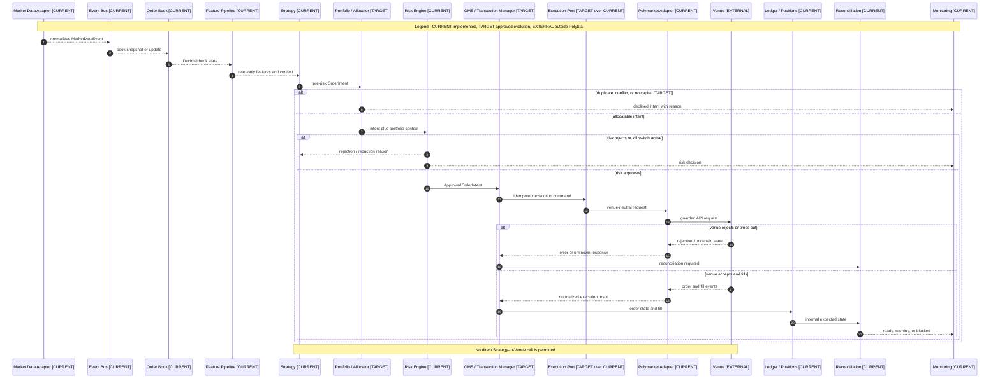

# Signal to Execution Sequence

- **Diagram ID:** PSA-ARCH-08
- **Purpose:** Show the end-to-end command/event sequence, including conflict, risk, venue rejection, and reconciliation paths.
- **Scope:** Current data, strategy, risk, adapter, state, reconciliation, and monitoring participants plus target allocator, OMS, and execution-port boundaries.
- **Architecture status:** MIXED
- **Audience:** Architects, execution developers, strategy developers, risk reviewers, and operators.
- **Source commit:** `8d64bb7bd5182bde5ed3a95c6ac26f7c859737a6`
- **Reviewed:** 2026-09-05

## Mermaid diagram

Canonical source: [`08-signal-to-execution-sequence.mmd`](../sources/08-signal-to-execution-sequence.mmd)

## Legend

CURRENT is solid, TARGET is dashed, FUTURE is dotted, EXTERNAL is gray, safety is amber, emergency/block is red, and approval/healthy is green. Arrow meanings follow [diagram conventions](../diagram-conventions.md).

## Main reading path

Read top to bottom. The alternatives show conflict/no-capital, risk rejection, venue uncertainty, and accepted fill paths.

## Current implementation mapping

Market adapter, event bus, order book, features, strategies, independent risk,
execution services, Polymarket adapter, positions, reconciliation, and
monitoring exist. The CURRENT bounded live slice is Strategy -> Risk ->
Execution -> Polymarket Adapter. It claims a persistent authorization, submits
at most one minimum-valid FAK entry, sizes at most one GTC exit from confirmed
fill/position state, and later reconciles delayed fills read-only.

## Target/future elements

Portfolio/Allocator, OMS/Transaction Manager, and generic Execution Port are TARGET. They formalize responsibilities currently spread across CLI, brokers, state models, and repositories.

## Related repository files

`src/polysia/bus/`, `src/polysia/orderbook/`, `src/polysia/features/`, `src/polysia/strategies/`, `src/polysia/risk/`, `src/polysia/execution/`, `src/polysia/adapters/polymarket/`, `src/polysia/portfolio/`, `src/polysia/reconciliation/`, `src/polysia/monitoring/`

## Related tests

`tests/integration/test_paper_vertical_slice.py`, live-broker negative-gate tests, reconciliation tests

## Related ADRs

ADR-0002, ADR-0004, ADR-0008, ADR-0009

## Related capabilities/requirements

CAP-001–CAP-011; REQ-002, REQ-004, REQ-006

## Assumptions

Target sequencing preserves current independent risk authority and adapter isolation.

## Known limitations

The sequence unifies current and target participants for clarity; labels must
be read before treating a participant as implemented. The TARGET allocator and
OMS must not be inserted into claims about the current bounded live path.

## Review trigger

Allocator, OMS, execution-port, or asynchronous execution-event behavior is implemented.
