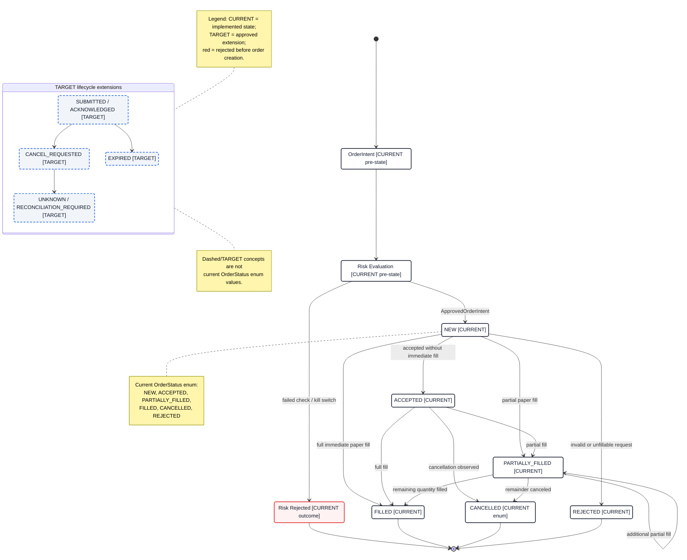

# Order Lifecycle State Machine

- **Diagram ID:** PSA-ARCH-09
- **Purpose:** Separate the actual current order states from approved lifecycle extensions.
- **Scope:** Intent/risk pre-states, the current `OrderStatus` enum, observed paper transitions, and target submission/recovery states.
- **Architecture status:** MIXED
- **Audience:** Execution developers, risk reviewers, reconciliation developers, and testers.
- **Source commit:** `44a8ae0fbccd0de916a0621236ea5931e7c3a256`

## Mermaid diagram

Canonical source: [`09-order-lifecycle-state-machine.mmd`](../sources/09-order-lifecycle-state-machine.mmd)

## Legend

CURRENT is solid, TARGET is dashed, FUTURE is dotted, EXTERNAL is gray, safety is amber, emergency/block is red, and approval/healthy is green. Arrow meanings follow [diagram conventions](../diagram-conventions.md).

## Main reading path

Start at `OrderIntent`, pass risk, then follow current states. Read the isolated target group only as a future extension.

## Current implementation mapping

Both domain and execution order models define `NEW`, `ACCEPTED`, `PARTIALLY_FILLED`, `FILLED`, `CANCELLED`, and `REJECTED`. `PaperOrder.add_fill` drives partial/full transitions; `PaperBroker` creates, accepts, fills, or rejects.

## Target/future elements

`SUBMITTED`, `ACKNOWLEDGED`, `CANCEL_REQUESTED`, `EXPIRED`, and `UNKNOWN/RECONCILIATION_REQUIRED` are TARGET concepts, not current enum values.

## Related repository files

`src/polysia/domain/orders/models.py`, `src/polysia/execution/order_state.py`, `src/polysia/execution/paper_broker.py`, `src/polysia/reconciliation/`

## Related tests

`tests/unit/execution/test_paper_broker.py`, order-state tests, reconciliation tests

## Related ADRs

ADR-0002, ADR-0008, ADR-0009

## Related capabilities/requirements

CAP-006, CAP-007, CAP-009, CAP-010; REQ-002, REQ-004

## Assumptions

Intent and risk are lifecycle pre-states, not values of the current order enum.

## Known limitations

`CANCELLED` exists in the current enum, but not every cancellation transition is owned by the paper broker.

## Review trigger

The canonical order enum, venue acknowledgement model, cancellation semantics, expiry, or recovery behavior changes.
