# Risk and Emergency Control

- **Diagram ID:** PSA-ARCH-10
- **Purpose:** Show independent pre-trade risk, live safety gates, emergency stop, and rejection paths.
- **Scope:** Risk context/limits, kill switch, reconciliation safety pause, approval, and guarded live execution controls.
- **Architecture status:** CURRENT
- **Audience:** Owner, risk reviewers, execution developers, security reviewers, and operators.
- **Source commit:** `44a8ae0fbccd0de916a0621236ea5931e7c3a256`

## Mermaid diagram

Canonical source: [`10-risk-and-emergency-control.mmd`](../sources/10-risk-and-emergency-control.mmd)

```mermaid
flowchart LR
  Intent["OrderIntent\n[CURRENT]"]:::strategy
  Context["RiskContext\nmode, live flag, positions, P&L, open orders, data age, edge\n[CURRENT]"]:::portfolio
  Limits["RiskLimits\nnotional, token/market position, loss, open orders, staleness, edge\n[CURRENT]"]:::risk
  Kill["Independent Kill Switch\n[CURRENT]"]:::danger
  Recon["Reconciliation Safety Pause\n[CURRENT]"]:::danger
  Engine["RiskEngine\nordered fail-fast checks\n[CURRENT]"]:::risk
  Approved["ApprovedOrderIntent\n[CURRENT]"]:::safe
  Rejected["Reject with reason\n[CURRENT]"]:::danger

  subgraph LIVE["Additional guarded live path [CURRENT]"]
    Mode["TRADING_MODE=LIVE"]:::risk
    Flag["LIVE_TRADING_ENABLED=true"]:::risk
    Allow["Token allowlist and hard caps"]:::risk
    Geo["Fail-closed geoblock check"]:::risk
    Ack["Explicit operator acknowledgement"]:::risk
    Once["One-attempt constraint"]:::risk
    Broker["Guarded LiveBroker / tiny-live command"]:::execution
  end

  Intent --> Engine
  Context --> Engine
  Limits --> Engine
  Kill -->|active: emergency stop| Engine
  Recon -->|mismatch: pause| Kill
  Engine -->|all checks pass| Approved
  Engine -->|first failure| Rejected
  Approved --> Mode
  Mode --> Flag
  Flag --> Allow
  Allow --> Geo
  Geo --> Ack
  Ack --> Once
  Once --> Broker
  Mode -->|not LIVE| Rejected
  Flag -->|false| Rejected
  Allow -->|not allowed / over cap| Rejected
  Geo -->|blocked / unreadable| Rejected
  Ack -->|missing| Rejected
  Kill -->|active| Broker
  Broker -->|no retry| Rejected

  subgraph LEGEND["Legend"]
    L1["CURRENT"]:::current
    L2["SAFETY CONTROL"]:::risk
    L3["EMERGENCY / BLOCK"]:::danger
    L4["APPROVED"]:::safe
  end

  classDef current fill:#FFFFFF,stroke:#0F172A,stroke-width:2px,color:#0F172A;
  classDef strategy fill:#FFFFFF,stroke:#7C3AED,stroke-width:2px,color:#0F172A;
  classDef portfolio fill:#EFF6FF,stroke:#1D4ED8,stroke-width:2px,color:#0F172A;
  classDef risk fill:#FFF7ED,stroke:#D97706,stroke-width:2.5px,color:#0F172A;
  classDef execution fill:#FFFFFF,stroke:#0891B2,stroke-width:2px,color:#0F172A;
  classDef safe fill:#F0FDF4,stroke:#16A34A,stroke-width:2px,color:#0F172A;
  classDef danger fill:#FEF2F2,stroke:#DC2626,stroke-width:2.5px,color:#0F172A;
```

## Legend

CURRENT is solid, TARGET is dashed, FUTURE is dotted, EXTERNAL is gray, safety is amber, emergency/block is red, and approval/healthy is green. Arrow meanings follow [diagram conventions](../diagram-conventions.md).

## Main reading path

Read intent/context/limits into `RiskEngine`; approved flow continues through every live gate, while any failed check reaches rejection. Kill switch and reconciliation can stop execution independently of strategy.

## Current implementation mapping

`RiskEngine` checks kill switch, mode, live flag, notional, token/market position, daily loss, open orders, stale data, and edge. Live tools add allowlist, caps, geoblock, acknowledgement, and one-attempt controls.

## Target/future elements

No broader live authority is proposed. Future risk controls must remain independent and require an approved change.

## Related repository files

`src/polysia/risk/`, `src/polysia/config/settings.py`, `src/polysia/execution/live_broker.py`, `src/polysia/execution/tiny_live_execution.py`, `src/polysia/adapters/polymarket/geoblock.py`, `src/polysia/reconciliation/safety_pause.py`

## Related tests

`tests/property/test_risk_properties.py`, risk unit tests, live-broker and tiny-live negative-gate tests, reconciliation safety-pause tests

## Related ADRs

ADR-0007, ADR-0008, ADR-0009

## Related capabilities/requirements

CAP-006, CAP-008, CAP-009, CAP-010; REQ-004, REQ-005

## Assumptions

Every state-changing live path retains all existing controls and explicit per-run authorization.

## Known limitations

The kill switch is in-process in the current local deployment; separate physical control is charter direction, not current implementation.

## Review trigger

Any risk limit, live gate, emergency path, acknowledgement, geoblock, or retry policy changes.
