# Reconciliation and Recovery

- **Diagram ID:** PSA-ARCH-11
- **Purpose:** Show external reconciliation and fail-closed Stage 4B accounting publication with their recovery controls.
- **Scope:** Expected/actual snapshots, Stage 4B tentative publication, invariant failures, safety pause, operator review, recovery, and audit output.
- **Architecture status:** CURRENT
- **Audience:** Operators, reconciliation developers, risk reviewers, and incident reviewers.
- **Source commit:** `a1b95235dbf430cb8fcc356e4ac4951a3359ccf9`
- **Reviewed:** 2026-09-06

## Mermaid diagram

Canonical source: [`11-reconciliation-and-recovery.mmd`](../sources/11-reconciliation-and-recovery.mmd)

```mermaid
flowchart LR
  Internal["Internal Expected State\nopen orders, positions, last states, fills, timestamps\n[CURRENT]"]:::portfolio
  External["External Account State\nreadability, orders, positions, geoblock\n[EXTERNAL data]"]:::external
  Compare["ReconciliationManager + Detectors\n[CURRENT]"]:::risk
  Events["Reconciliation Events\nmanual cancel/close, unexpected fill/order, missing order, stale/read failure\n[CURRENT]"]:::observability
  Ready["READY\ncontinue under existing controls"]:::safe
  Warning["WARNING\noperator review"]:::risk
  Blocked["BLOCKED\ntrading_should_pause"]:::danger
  Pause["Safety Pause / Kill Switch\n[CURRENT]"]:::danger
  Operator["Operator Review and Manual Acknowledgement\n[CURRENT]"]:::current
  Recover["Correct state, restore readability, or rollback\n[CURRENT operational action]"]:::current
  Audit["Reports, audit evidence, monitoring\n[CURRENT]"]:::observability

  subgraph SHADOW["Stage 4B accounting publication [CURRENT]"]
    Tentative["Tentative portfolio, positions, ledger\ninside one transaction"]:::portfolio
    Invariants["Accounting + publication invariants"]:::risk
    Published["COMMIT + success + watermark"]:::safe
    AccountingBlocked["ROLLBACK + failed evidence\naccounting_blocked + controlled stop"]:::danger
  end

  Internal --> Compare
  External --> Compare
  Compare --> Events
  Events -->|no blocking event| Ready
  Events -->|non-blocking discrepancy| Warning
  Events -->|blocking or live uncertainty| Blocked
  Blocked --> Pause
  Pause --> Operator
  Warning --> Operator
  Operator --> Recover
  Recover -->|new snapshot| Compare
  Ready --> Audit
  Warning --> Audit
  Blocked --> Audit
  Tentative --> Invariants
  Invariants -->|pass| Published
  Invariants -->|fail| AccountingBlocked
  Published --> Audit
  AccountingBlocked --> Audit
  AccountingBlocked --> Operator
  Recover -->|explicit repair / verified restore| Invariants

  subgraph LEGEND["Legend"]
    L1["CURRENT"]:::current
    L2["EXTERNAL STATE"]:::external
    L3["WARNING / SAFETY"]:::risk
    L4["BLOCK / PAUSE"]:::danger
    L5["HEALTHY"]:::safe
  end

  classDef current fill:#FFFFFF,stroke:#0F172A,stroke-width:2px,color:#0F172A;
  classDef external fill:#F1F5F9,stroke:#64748B,stroke-width:1.5px,color:#475569;
  classDef portfolio fill:#EFF6FF,stroke:#1D4ED8,stroke-width:2px,color:#0F172A;
  classDef risk fill:#FFF7ED,stroke:#D97706,stroke-width:2.5px,color:#0F172A;
  classDef observability fill:#FFFFFF,stroke:#9333EA,stroke-width:2px,color:#0F172A;
  classDef safe fill:#F0FDF4,stroke:#16A34A,stroke-width:2px,color:#0F172A;
  classDef danger fill:#FEF2F2,stroke:#DC2626,stroke-width:2.5px,color:#0F172A;
```

## Legend

CURRENT is solid, TARGET is dashed, FUTURE is dotted, EXTERNAL is gray, safety is amber, emergency/block is red, and approval/healthy is green. Arrow meanings follow [diagram conventions](../diagram-conventions.md).

## Main reading path

Feed internal and external state into reconciliation, classify events, then follow
ready, warning, or blocked paths. In parallel, publish tentative Stage 4B state
only when accounting and publication invariants pass; otherwise roll back,
record `accounting_blocked`, and require explicit verified recovery.

## Current implementation mapping

Current models capture orders, positions, fills, fees, ledger events, realized
P&L, read/geoblock status, timestamps, severity, blocking reasons, warnings,
pause, and manual acknowledgement. The bounded round-trip service loads durable
checkpoints, matches durable venue identifiers, ingests delayed exit fills once,
updates order/position/ledger/P&L state transactionally, and persists a stable
classification. The lifecycle monitor adds idempotent `INFO`, `WARNING`, and
`CRITICAL` alerts without any order-submit/cancel capability. Stage 4B evaluates
the same accounting and duplicate-publication invariants before marking a poll
successful, advancing its watermark, checkpointing, or committing. Failure
rolls back tentative state, preserves failed evidence, and stops the worker in a
controlled way without creating an automatic restart loop.

## Target/future elements

No target element is needed for the current recovery logic. A future generalized ledger may provide richer snapshots and immutable audit events.

## Related repository files

`src/polysia/reconciliation/live_round_trip.py`,
`src/polysia/adapters/polymarket/round_trip_reconciliation.py`,
`src/polysia/monitoring/live_round_trip.py`,
`src/polysia/adapters/polymarket/lifecycle_monitoring.py`,
`src/polysia/storage/schemas.sql`, `src/polysia/storage/continuous_shadow.py`,
`src/polysia/storage/continuous_shadow_invariants.py`,
`src/polysia/risk/kill_switch.py`

## Related tests

round-trip reconciliation/monitor unit and adapter contract tests, Stage 4B
accounting-blocked integration tests, storage transaction/idempotency tests,
property tests, and the bounded vertical slice

## Related ADRs

ADR-0008, ADR-0009, ADR-0014, ADR-0015

## Related capabilities/requirements

CAP-010, CAP-011; REQ-002, REQ-004

## Assumptions

Unreadable or uncertain live state is treated conservatively and may block.

## Known limitations

Recovery and monitoring remain local to the controlled host. A continuous
Docker monitor and Wallet Intelligence systemd timers are CURRENT, but external
alert delivery and automated disaster recovery are not. A missing terminal
order detail remains a warning unless confirmed fills and position evidence
cannot safely prove the state.

## Review trigger

Snapshot fields, mismatch taxonomy, blocking rules, safety-pause behavior, or acknowledgement changes.
