# Runtime Modes and Promotion

- **Diagram ID:** PSA-ARCH-12
- **Purpose:** Distinguish implemented runtime controls from workflow stages and future capital promotion.
- **Scope:** `TradingMode` enum, replay/paper/shadow/tiny-live workflows, and the evidence-based maturity path.
- **Architecture status:** MIXED
- **Audience:** Owner, operators, researchers, risk reviewers, and release reviewers.
- **Source commit:** `8d64bb7bd5182bde5ed3a95c6ac26f7c859737a6`
- **Reviewed:** 2026-09-05

## Mermaid diagram

Canonical source: [`12-runtime-modes-and-promotion.mmd`](../sources/12-runtime-modes-and-promotion.mmd)

```mermaid
flowchart LR
  subgraph MODES["Implemented runtime controls"]
    DataOnly["DATA_ONLY\nCURRENT enum; orders blocked"]:::current
    PaperMode["PAPER\nCURRENT enum; local paper broker"]:::current
    LiveMode["LIVE\nCURRENT enum; disabled by default and gated"]:::risk
  end

  subgraph WORKFLOWS["Implemented workflows"]
    Replay["Focused Backtest / Replay\nCURRENT"]:::current
    Paper["Paper Run\nCURRENT"]:::current
    Shadow["Shadow Workflow\nCURRENT workflow, not enum"]:::current
    Control["SHADOW-only Control Kernel\nRUNNING / PAUSED for stale-price@0.1.0\nCURRENT bounded"]:::current
    Limited["Tiny / Limited Live Tooling\nCURRENT experimental, explicit authorization"]:::risk
  end

  subgraph MATURITY["Evidence-based maturity path"]
    Research["Research"]:::current
    OOS["Out-of-Sample Check\n[TARGET discipline]"]:::target
    Micro["Micro-Capital Live\n[TARGET promotion gate]"]:::target
    Scale["Controlled Scaling\n[FUTURE]"]:::future
  end

  Research --> Replay
  Replay --> OOS
  OOS --> Paper
  Paper --> Shadow
  Control -->|gates new intents only; never cancels or closes| Shadow
  Shadow --> Micro
  Micro -.-> Scale

  DataOnly -->|permits reads/research| Research
  PaperMode --> Paper
  PaperMode --> Shadow
  DataOnly --> Control
  LiveMode -->|flag + allowlist + caps + geoblock + ack + risk + kill switch| Limited
  Limited -.->|evidence only; owner-approved promotion| Micro
  DataOnly -->|rejects intents| LiveMode

  subgraph LEGEND["Legend"]
    L1["CURRENT solid"]:::current
    L2["TARGET dashed"]:::target
    L3["FUTURE dotted"]:::future
    L4["GATED LIVE / SAFETY"]:::risk
  end

  classDef current fill:#FFFFFF,stroke:#0F172A,stroke-width:2px,color:#0F172A;
  classDef target fill:#F1F5F9,stroke:#2563EB,stroke-width:2px,stroke-dasharray:6 4,color:#0F172A;
  classDef future fill:#F1F5F9,stroke:#64748B,stroke-width:2px,stroke-dasharray:2 5,color:#475569;
  classDef risk fill:#FFF7ED,stroke:#D97706,stroke-width:2.5px,color:#0F172A;
```

## Legend

CURRENT is solid, TARGET is dashed, FUTURE is dotted, EXTERNAL is gray, safety is amber, emergency/block is red, and approval/healthy is green. Arrow meanings follow [diagram conventions](../diagram-conventions.md).

## Main reading path

Read current enum modes at the top, current workflows in the middle, and evidence-based maturity from research toward controlled scaling.

## Current implementation mapping

The actual enum is `DATA_ONLY`, `PAPER`, and `LIVE`. Replay, paper, local
shadow, public real-data shadow, and guarded tiny-live commands are implemented
workflows. The Control Kernel can request `RUNNING` or `PAUSED` only for the
deterministic `stale-price@0.1.0` Shadow path. `PAUSED` suppresses new intents;
it is not cancellation, position closure, emergency control, or Live authority.
LIVE-004 proves one bounded execution/reconciliation path, not a promotion
decision.

## Target/future elements

Historical data validation, realistic fee/slippage-aware backtesting, and a
large Paper/Shadow sample are the immediate validation cycle. Out-of-sample
discipline and micro-capital promotion remain TARGET gates. Controlled scaling
is FUTURE and has no release date.

## Related repository files

`src/polysia/config/settings.py`, `src/polysia/backtesting/`,
`src/polysia/control/`, `src/polysia/execution/paper_broker.py`,
`src/polysia/monitoring/shadow_run.py`,
`src/polysia/monitoring/real_data_shadow_run.py`,
`src/polysia/execution/tiny_live_execution.py`

## Related tests

Settings, replay, paper broker, Shadow Control Kernel, real-data Shadow, and
tiny-live tests, including
`tests/integration/test_shadow_control_vertical_slice.py`

## Related ADRs

ADR-0007, ADR-0008, ADR-0009, ADR-0012

## Related capabilities/requirements

CAP-005–CAP-012; REQ-002, REQ-004, REQ-005

## Assumptions

Promotion requires evidence and owner approval; mode names do not themselves grant execution authority.

## Known limitations

`SHADOW` is not a `TradingMode` value. Broader micro-capital live and controlled
scaling are not approved current operating stages; all existing live
authorizations are consumed.

## Review trigger

The runtime enum, workflow taxonomy, promotion gates, or capital authority changes.
