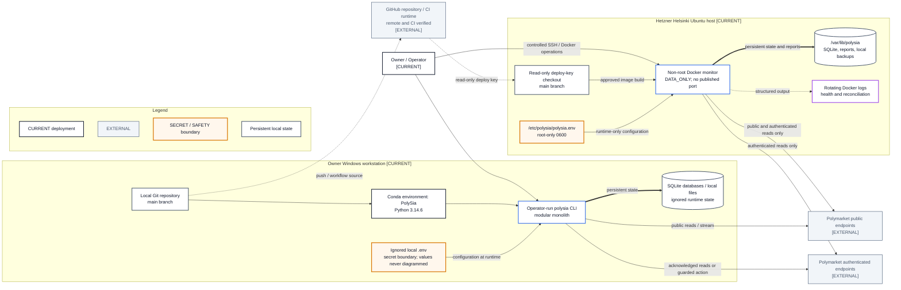

# Current Deployment View

- **Diagram ID:** PSA-ARCH-13
- **Purpose:** Represent only verified current deployment and runtime facts.
- **Scope:** Owner workstation, controlled Helsinki host, Docker monitor, persistent state, secret boundaries, Polymarket endpoints, and configured CI.
- **Architecture status:** CURRENT
- **Audience:** Owner, operators, developers, security reviewers, and deployment reviewers.
- **Verified deployment source:** `52c1bcc980f7db797066f982b23ab755dca31f58`

## Mermaid diagram

Canonical source: [`13-current-deployment-view.mmd`](../sources/13-current-deployment-view.mmd)

## Legend

CURRENT is solid, TARGET is dashed, FUTURE is dotted, EXTERNAL is gray, safety is amber, emergency/block is red, and approval/healthy is green. Arrow meanings follow [diagram conventions](../diagram-conventions.md).

## Main reading path

Start at the owner workstation and GitHub, then follow the approved source to
the single controlled Docker runtime, persistent state, monitoring, and
external read-only endpoints.

## Current implementation mapping

The current deployment remains one Python modular monolith. Local operator use
continues in the `PolySia` Python 3.14.6 Conda environment. The continuously
managed runtime is one non-root Docker container on the controlled Ubuntu host.
It forces `DATA_ONLY`, disables live trading, clears the live allowlist, exposes
no port, persists SQLite and reports, writes rotating logs, and runs read-only
monitoring and reconciliation. GitHub CI verifies Python 3.11/3.13/3.14, Linux,
the container, and supply-chain gates.

## Target/future elements

External alert delivery, encrypted off-host backups, high availability,
additional hosts, queues, and orchestration remain TARGET or FUTURE.

## Related repository files

`Dockerfile`, `compose.yaml`, `deploy/polysia.env.example`,
`docs/10-operations/server-deployment.md`, `environment.yml`, `locks/`,
`.github/workflows/ci.yml`, `src/polysia/storage/`,
`src/polysia/config/settings.py`

## Related tests

Container CI, deployment/readiness tests, SQLite backup tests, storage tests,
and the controlled server deployment handoff

## Related ADRs

ADR-0002, ADR-0006, ADR-0007, ADR-0009

## Related capabilities/requirements

CAP-004, CAP-008, CAP-011, CAP-012; REQ-005, REQ-007

## Assumptions

The server remains a single controlled host and operates only in read-only
`DATA_ONLY` mode.

## Known limitations

The verified backup remains on the same server; encrypted off-host backup is
not configured. External alert delivery and high availability are absent.
SQLite remains limited to the current single-runtime workload. Credentials and
operational state remain outside Git.

## Review trigger

Runtime host, environment, storage, secrets handling, CI ownership, or process topology changes.
