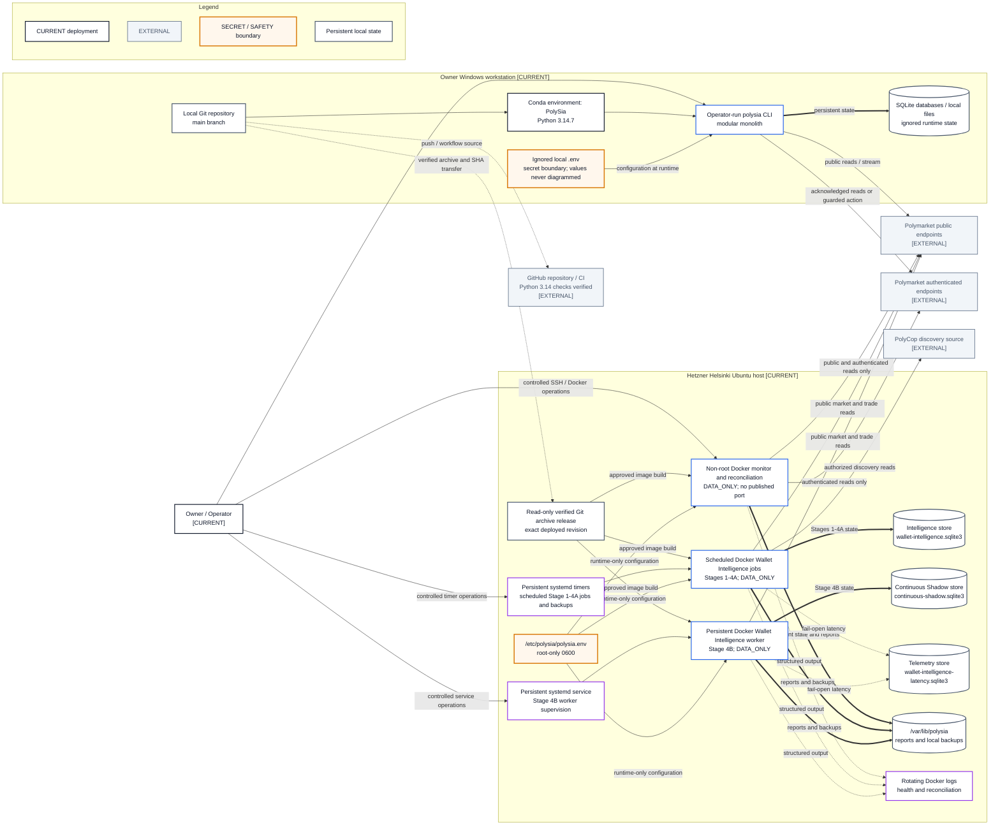

# Current Deployment View

- **Diagram ID:** PSA-ARCH-13
- **Purpose:** Represent only verified current deployment and runtime facts.
- **Scope:** Owner workstation, controlled Helsinki host, verified release transfer, Docker monitor, scheduled Stages 1–4A, persistent Stage 4B worker, physically separate stores, secret boundaries, external data endpoints, and configured CI.
- **Architecture status:** CURRENT
- **Audience:** Owner, operators, developers, security reviewers, and deployment reviewers.
- **Source commit:** `8d64bb7bd5182bde5ed3a95c6ac26f7c859737a6`
- **Reviewed:** 2026-09-05
- **Verified deployment source:** `6743f7464f94d3fb76edc057834e8219ca7ebfe0`

## Mermaid diagram

Canonical source: [`13-current-deployment-view.mmd`](../sources/13-current-deployment-view.mmd)

## Legend

CURRENT is solid, TARGET is dashed, FUTURE is dotted, EXTERNAL is gray, safety is amber, emergency/block is red, and approval/healthy is green. Arrow meanings follow [diagram conventions](../diagram-conventions.md).

## Main reading path

Start at the owner workstation and GitHub, then follow the verified archive to
the controlled Docker monitor and scheduled Wallet Intelligence jobs,
persistent state, monitoring, and external read-only endpoints.

## Current implementation mapping

The current deployment remains one Python modular monolith. Local operator use
continues in the `PolySia` Python 3.14.7 Conda environment. The continuously
managed runtime includes the non-root Docker monitor plus systemd-triggered,
ephemeral Wallet Intelligence Stage 1–4B jobs on the controlled Ubuntu host.
The host receives a verified exact-commit Git archive because repository Deploy
Keys are disabled. All current services force `DATA_ONLY`, disable live trading,
expose no port, persist SQLite and reports, and write bounded operational output.
Current GitHub CI supports Python 3.14 only. It
runs lightweight documentation/Standards/secret checks on every pull request,
uses Linux as the canonical complete quality and applicable locked-wheel path,
keeps full Windows workstation compatibility weekly, manually, and for
Windows-sensitive changes, adds container checks for deployment-relevant
changes, and runs supply-chain checks for dependency changes, weekly schedules,
and manual dispatch.

## Target/future elements

External alert delivery, encrypted off-host backups, high availability,
additional hosts, queues, and orchestration remain TARGET or FUTURE.

## Related repository files

`Dockerfile`, `compose.yaml`, `deploy/polysia.env.example`,
`docs/10-operations/server-deployment.md`, `environment.yml`, `locks/`,
`.github/workflows/ci.yml`, `src/polysia/storage/`,
`src/polysia/config/settings.py`

## Related tests

Container CI, deployment/readiness tests, SQLite backup tests, storage tests,
and the controlled server deployment handoff

## Related ADRs

ADR-0002, ADR-0006, ADR-0007, ADR-0009

## Related capabilities/requirements

CAP-004, CAP-008, CAP-011, CAP-012; REQ-005, REQ-007

## Assumptions

The latest approved deployment evidence records one controlled host operating
only in read-only `DATA_ONLY` mode. This documentation refresh did not contact
or mutate the external host.

## Known limitations

The verified backup remains on the same server; encrypted off-host backup is
not configured. External alert delivery and high availability are absent.
SQLite remains limited to the current single-runtime workload. Credentials and
operational state remain outside Git.
The deployed revision predates this repository baseline; repository changes
after `6743f7464f94d3fb76edc057834e8219ca7ebfe0` are not claimed as deployed.

## Review trigger

Runtime host, environment, storage, secrets handling, CI ownership, or process topology changes.
