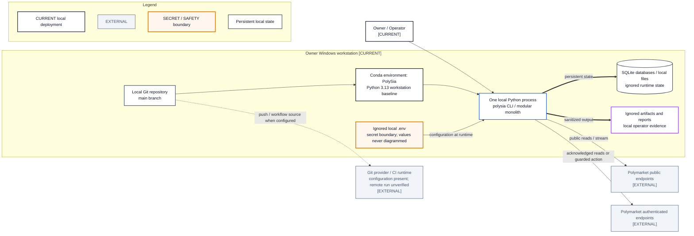

# Current Deployment View

- **Diagram ID:** PSA-ARCH-13
- **Purpose:** Represent only verified current deployment and runtime facts.
- **Scope:** Owner Windows workstation, Conda environment, local Python process, local Git/files/SQLite, ignored secrets/evidence, Polymarket endpoints, and configured CI.
- **Architecture status:** CURRENT
- **Audience:** Owner, operators, developers, security reviewers, and deployment reviewers.
- **Source commit:** `44a8ae0fbccd0de916a0621236ea5931e7c3a256`

## Mermaid diagram

Canonical source: [`13-current-deployment-view.mmd`](../sources/13-current-deployment-view.mmd)

## Legend

CURRENT is solid, TARGET is dashed, FUTURE is dotted, EXTERNAL is gray, safety is amber, emergency/block is red, and approval/healthy is green. Arrow meanings follow [diagram conventions](../diagram-conventions.md).

## Main reading path

Start at the owner workstation, then follow local process dependencies to files and external endpoints. Treat Git/CI as configured but not remotely verified.

## Current implementation mapping

The current deployment is one local Python process in the `PolySia` Conda environment. SQLite and reports are local. `.env` is ignored. Public and authenticated Polymarket endpoints are external.

## Target/future elements

No cloud, VPS, container, queue, scheduler, or production infrastructure is shown as current.

## Related repository files

`environment.yml`, `locks/`, `pyproject.toml`, `.gitignore`, `.github/workflows/ci.yml`, `src/polysia/storage/`, `src/polysia/config/settings.py`

## Related tests

Phase I handoff, deployment/readiness tests, storage tests, migration tests

## Related ADRs

ADR-0002, ADR-0006, ADR-0007, ADR-0009

## Related capabilities/requirements

CAP-004, CAP-008, CAP-011, CAP-012; REQ-005, REQ-007

## Assumptions

The verified owner workstation remains the current execution host.

## Known limitations

Remote CI execution and branch protection are not verified; local SQLite files and operational artifacts are intentionally ignored.

## Review trigger

Runtime host, environment, storage, secrets handling, CI ownership, or process topology changes.
