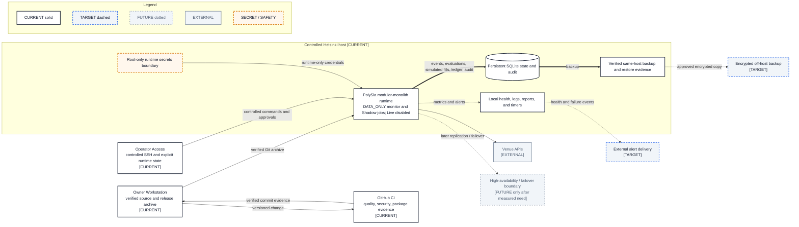

# Deployment Evolution View

- **Diagram ID:** PSA-ARCH-14
- **Purpose:** Show the current conservative single-host foundation and the next justified operational improvements.
- **Scope:** Developer workstation, CI, controlled host, runtime safety, secrets, SQLite state, monitoring, local backup, target off-host recovery and alerts, and optional later HA.
- **Architecture status:** MIXED
- **Audience:** Owner, architects, operations engineers, security reviewers, and release planners.
- **Source commit:** `8d64bb7bd5182bde5ed3a95c6ac26f7c859737a6`
- **Reviewed:** 2026-09-05

## Mermaid diagram

Canonical source: [`14-target-deployment-view.mmd`](../sources/14-target-deployment-view.mmd)

## Legend

CURRENT is solid, TARGET is dashed, FUTURE is dotted, EXTERNAL is gray, safety is amber, emergency/block is red, and approval/healthy is green. Arrow meanings follow [diagram conventions](../diagram-conventions.md).

## Main reading path

Follow a versioned change through CI and the verified archive to the controlled
runtime, then inspect operator, secrets, state, monitoring, backup, and venue
boundaries before the target recovery and alert extensions.

## Current implementation mapping

The controlled Helsinki host, immutable release transfer, DATA_ONLY Docker
runtime, systemd timers, root-only secret file, SQLite state, local monitoring,
and verified same-host backup/restore are CURRENT.

## Target/future elements

Encrypted off-host backup and external alert delivery are TARGET. A stronger
database or high availability remains optional and must be justified by measured
need rather than assumed now.

## Related repository files

`docs/00-governance/master-operating-charter.md`, `docs/22-roadmap/roadmap.md`, `.github/workflows/ci.yml`, `src/polysia/config/`, `src/polysia/monitoring/`

## Related tests

Current foundation evidence: deployment/readiness tests, storage tests, security/redaction tests

## Related ADRs

ADR-0002, ADR-0006, ADR-0007, ADR-0008, ADR-0009

## Related capabilities/requirements

Current CAP-004, CAP-008, CAP-011, CAP-012; Charter §§47 and 63

## Assumptions

A single controlled host is preferred until measured reliability or isolation needs justify more.

## Known limitations

No off-host backup provider, external alert provider, RTO, RPO, stronger database
product, orchestration platform, or HA design has been approved.

## Review trigger

A deployment, storage, alerting, backup objective, or availability boundary changes.
