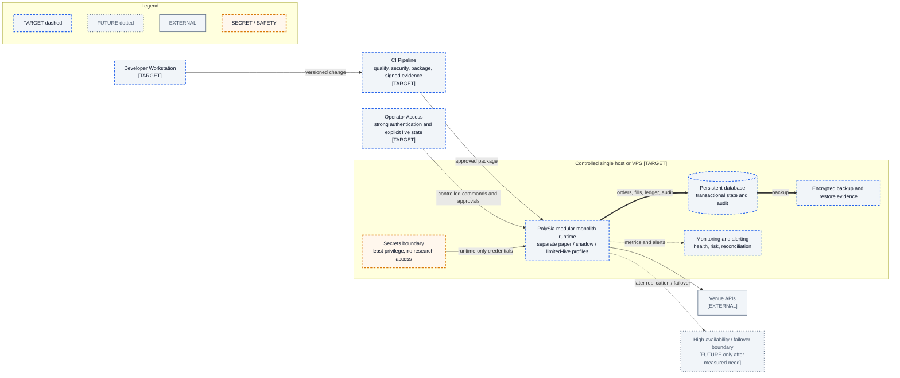

# Target Deployment View

- **Diagram ID:** PSA-ARCH-14
- **Purpose:** Show a conservative single-host target path with explicit secrets, persistence, monitoring, backup, and operator boundaries.
- **Scope:** Developer workstation, CI, controlled host/VPS, runtime profiles, secrets, persistent database, monitoring, backup, operator access, venue, and optional later HA.
- **Architecture status:** TARGET
- **Audience:** Owner, architects, operations engineers, security reviewers, and release planners.
- **Source commit:** `44a8ae0fbccd0de916a0621236ea5931e7c3a256`

## Mermaid diagram

Canonical source: [`14-target-deployment-view.mmd`](../sources/14-target-deployment-view.mmd)

## Legend

CURRENT is solid, TARGET is dashed, FUTURE is dotted, EXTERNAL is gray, safety is amber, emergency/block is red, and approval/healthy is green. Arrow meanings follow [diagram conventions](../diagram-conventions.md).

## Main reading path

Follow a versioned change through CI to one controlled runtime, then inspect operator, secrets, state, monitoring, backup, and venue boundaries.

## Current implementation mapping

Current local runtime, CI configuration, SQLite, monitoring, and safe configuration are foundations only.

## Target/future elements

Controlled host/VPS, runtime profiles, managed secret boundary, stronger database, monitoring/alerts, backup/restore, and authenticated operator access are TARGET. High availability is FUTURE.

## Related repository files

`docs/00-governance/master-operating-charter.md`, `docs/22-roadmap/roadmap.md`, `.github/workflows/ci.yml`, `src/polysia/config/`, `src/polysia/monitoring/`

## Related tests

Current foundation evidence: deployment/readiness tests, storage tests, security/redaction tests

## Related ADRs

ADR-0002, ADR-0006, ADR-0007, ADR-0008, ADR-0009

## Related capabilities/requirements

Current CAP-004, CAP-008, CAP-011, CAP-012; Charter §§47 and 63

## Assumptions

A single controlled host is preferred until measured reliability or isolation needs justify more.

## Known limitations

No provider, database product, orchestration platform, RTO, RPO, or HA design has been approved.

## Review trigger

A deployment RFC selects a host, database, secret store, backup objective, or availability target.
