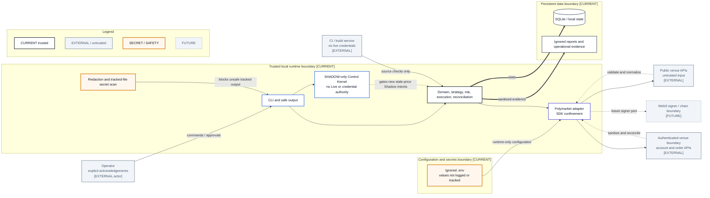

# Trust Boundaries

- **Diagram ID:** PSA-ARCH-15
- **Purpose:** Make trusted runtime, secrets, persistent state, operator, CI, public API, authenticated venue, and future signer boundaries explicit.
- **Scope:** Security-relevant data and command crossings without any real identifiers or account data.
- **Architecture status:** MIXED
- **Audience:** Security reviewers, owner, operators, architects, and execution developers.
- **Source commit:** `ac104c708100bf9fff7e632acefd89bf90b8e509`

## Mermaid diagram

Canonical source: [`15-trust-boundaries.mmd`](../sources/15-trust-boundaries.mmd)

## Legend

CURRENT is solid, TARGET is dashed, FUTURE is dotted, EXTERNAL is gray, safety is amber, emergency/block is red, and approval/healthy is green. Arrow meanings follow [diagram conventions](../diagram-conventions.md).

## Main reading path

Read from external actors/services into the trusted local runtime, then inspect separate secrets and persistent-data boundaries.

## Current implementation mapping

Current controls include ignored `.env`, safe settings output, SDK confinement,
redaction, tracked-file secret scan, local SQLite, and ignored evidence. The
Control Kernel is inside the trusted process but is bounded to Shadow intent
gating; it has no Live or credential authority.

## Target/future elements

A future Web3 signer/chain integration requires a new isolated trust boundary. CI remains credential-free for ordinary jobs.

## Related repository files

`.gitignore`, `src/polysia/config/settings.py`, `src/polysia/control/`,
`src/polysia/security/secret_scan.py`, `src/polysia/adapters/polymarket/`,
`src/polysia/storage/`, `.github/workflows/ci.yml`

## Related tests

security scanner tests, redaction tests, `tests/architecture/test_boundaries.py`, deployment/readiness tests

## Related ADRs

ADR-0004, ADR-0007, ADR-0008, ADR-0009, ADR-0012

## Related capabilities/requirements

CAP-004, CAP-008–CAP-012; REQ-004, REQ-005, REQ-006

## Assumptions

All external API data is untrusted until validated/mapped; secrets are runtime-only.

## Known limitations

This is an architecture trust view, not a complete threat model or network-control design.

## Review trigger

A credential source, signer, external API, persistent store, CI privilege, or operator access path changes.
