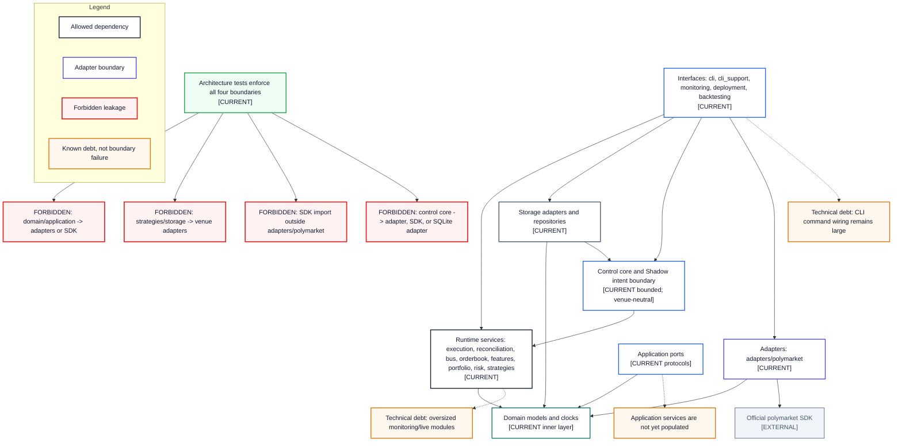

# Module Dependency Map

- **Diagram ID:** PSA-ARCH-16
- **Purpose:** Show allowed inward dependencies, enforced forbidden leakage, SDK confinement, and acknowledged module debt.
- **Scope:** Architectural dependency zones rather than every import edge.
- **Architecture status:** CURRENT
- **Audience:** Developers, maintainers, architects, and code reviewers.
- **Source commit:** `449f1c308fc74bd2a541e0e905f281fd19e5cd9b`

## Mermaid diagram

Canonical source: [`16-module-dependency-map.mmd`](../sources/16-module-dependency-map.mmd)

## Legend

CURRENT is solid, TARGET is dashed, FUTURE is dotted, EXTERNAL is gray, safety is amber, emergency/block is red, and approval/healthy is green. Arrow meanings follow [diagram conventions](../diagram-conventions.md).

## Main reading path

Read allowed arrows toward domain, then the separate forbidden-boundary checks and non-failing technical-debt notes.

## Current implementation mapping

Architecture tests prohibit domain/application adapter or SDK imports,
strategy/storage adapter imports, and official SDK imports outside
`adapters/polymarket`. They also keep the Control Kernel venue-neutral and keep
its core free of the SQLite storage adapter. Current outer services may depend
on adapters where operationally required.

## Target/future elements

Application services are not yet populated; future dependency inversion should use current ports more broadly without claiming that wiring today.

## Related repository files

`src/polysia/domain/`, `src/polysia/application/`, `src/polysia/control/`,
`src/polysia/adapters/`, `src/polysia/strategies/`, `src/polysia/storage/`,
`docs/00-governance/registers/technical-debt.md`

## Related tests

`tests/architecture/test_boundaries.py`, `tests/architecture/test_module_decomposition.py`

## Related ADRs

ADR-0002, ADR-0004, ADR-0011, ADR-0012

## Related capabilities/requirements

CAP-001–CAP-010; REQ-006

## Assumptions

Dependency direction is assessed at architectural zones; outer operational modules may coordinate several zones.

## Known limitations

This is not an exhaustive generated import graph. CLI and monitoring remain intentionally broad and are tracked debt.

## Review trigger

An architecture test changes, SDK import moves, inner-layer dependency appears, or a top-level package is reclassified.
