# Adapter Extension Model

- **Diagram ID:** PSA-ARCH-17
- **Purpose:** Show how a future venue is added without rewriting strategy, risk, or canonical domain contracts.
- **Scope:** Domain contracts, application ports, target registry/capability discovery, adapter responsibilities, Polymarket current implementation, and future adapter categories.
- **Architecture status:** MIXED
- **Audience:** Integration developers, architects, owner, risk reviewers, and roadmap planners.
- **Source commit:** `449f1c308fc74bd2a541e0e905f281fd19e5cd9b`

## Mermaid diagram

Canonical source: [`17-adapter-extension-model.mmd`](../sources/17-adapter-extension-model.mmd)

```mermaid
flowchart LR
  Core["Canonical Domain Contracts\nmarkets, events, intents, orders, fills, ledger, reconciliation\n[CURRENT]"]:::domain
  Ports["Application Ports\ncatalog, data, execution, account reads, repository, bus, emergency\n[CURRENT protocols]"]:::application
  Registry["Adapter Registry / Capability Discovery\n[TARGET]"]:::target

  subgraph CONTRACT["Adapter responsibilities"]
    Capability["Capability Profile"]:::adapter
    Public["Public Data and Discovery"]:::adapter
    Auth["Authenticated Account Reads"]:::adapter
    Exec["Execution and Cancellation"]:::adapter
    Map["Mapping and Venue Rules"]:::adapter
    Settle["Settlement / Reconciliation Mapping"]:::adapter
  end

  Polymarket["Polymarket Adapter\n[CURRENT]"]:::current
  Prediction["Another prediction market\n[FUTURE]"]:::future
  Exchange["Centralized exchange\n[FUTURE]"]:::future
  Broker["Broker\n[FUTURE]"]:::future
  Web3["Web3 protocol / chain\n[FUTURE]"]:::future
  External["Venue-specific APIs and SDKs\n[EXTERNAL]"]:::external

  Core --> Ports
  Ports --> Registry
  Registry --> Capability
  Capability --> Public
  Capability --> Auth
  Capability --> Exec
  Public --> Map
  Auth --> Map
  Exec --> Map
  Map --> Settle
  Settle --> Polymarket
  Settle -.-> Prediction
  Settle -.-> Exchange
  Settle -.-> Broker
  Settle -.-> Web3
  Polymarket --> External
  Prediction -.-> External
  Exchange -.-> External
  Broker -.-> External
  Web3 -.-> External

  subgraph RULE["Extension rule"]
    Add["Add adapter + capability metadata + mappers + contract tests\nDo not rewrite strategy or risk core"]:::safe
  end

  subgraph LEGEND["Legend"]
    L1["CURRENT"]:::current
    L2["TARGET"]:::target
    L3["FUTURE"]:::future
    L4["EXTERNAL"]:::external
  end

  classDef current fill:#FFFFFF,stroke:#0F172A,stroke-width:2px,color:#0F172A;
  classDef target fill:#F1F5F9,stroke:#2563EB,stroke-width:2px,stroke-dasharray:6 4,color:#0F172A;
  classDef future fill:#F1F5F9,stroke:#64748B,stroke-width:2px,stroke-dasharray:2 5,color:#475569;
  classDef external fill:#F1F5F9,stroke:#64748B,stroke-width:1.5px,color:#475569;
  classDef domain fill:#FFFFFF,stroke:#0F766E,stroke-width:2px,color:#0F172A;
  classDef application fill:#FFFFFF,stroke:#2563EB,stroke-width:2px,color:#0F172A;
  classDef adapter fill:#FFFFFF,stroke:#4F46E5,stroke-width:2px,color:#0F172A;
  classDef safe fill:#F0FDF4,stroke:#16A34A,stroke-width:2px,color:#0F172A;
```

## Legend

CURRENT is solid, TARGET is dashed, FUTURE is dotted, EXTERNAL is gray, safety is amber, emergency/block is red, and approval/healthy is green. Arrow meanings follow [diagram conventions](../diagram-conventions.md).

## Main reading path

Start at canonical contracts and ports, pass through target capability discovery and adapter responsibilities, then branch to current Polymarket and future venue types.

## Current implementation mapping

Current Polymarket files implement capability metadata, public/secure/stream/geoblock behavior, mappers, and contract-tested SDK calls.

## Target/future elements

Adapter registry/capability discovery is TARGET. Other prediction markets, exchanges, brokers, and Web3 integrations are FUTURE.

## Related repository files

`src/polysia/domain/`, `src/polysia/application/ports/`, `src/polysia/adapters/polymarket/`, `docs/04-architecture/polymarket-adapter.md`

## Related tests

`tests/architecture/test_boundaries.py`, `tests/contract/test_polymarket_sdk_surface.py`, adapter unit tests

## Related ADRs

ADR-0002, ADR-0004, ADR-0005, ADR-0008

## Related capabilities/requirements

CAP-001, CAP-008, CAP-009, CAP-010; REQ-001, REQ-004, REQ-006

## Assumptions

Capabilities remain explicit per venue; PolySia avoids a lowest-common-denominator core.

## Known limitations

Settlement behavior and future venue contracts need requirements before implementation; no future vendor is selected.

## Review trigger

A new adapter, capability field, venue rule, mapping, settlement model, or SDK upgrade is proposed.
