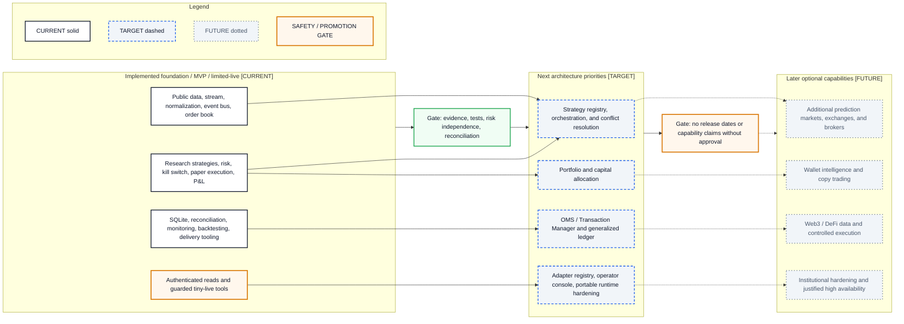

# Capability Roadmap

- **Diagram ID:** PSA-ARCH-18
- **Purpose:** Visualize current capabilities, next architecture priorities, and later optional extensions without implying release dates.
- **Scope:** Foundation/MVP/limited-live capabilities, target orchestration and platform boundaries, and future multi-market/Web3/institutional categories.
- **Architecture status:** MIXED
- **Audience:** Owner, roadmap reviewers, architects, developers, and risk reviewers.
- **Source commit:** `44a8ae0fbccd0de916a0621236ea5931e7c3a256`

## Mermaid diagram

Canonical source: [`18-capability-roadmap.mmd`](../sources/18-capability-roadmap.mmd)

## Legend

CURRENT is solid, TARGET is dashed, FUTURE is dotted, EXTERNAL is gray, safety is amber, emergency/block is red, and approval/healthy is green. Arrow meanings follow [diagram conventions](../diagram-conventions.md).

## Main reading path

Read CURRENT capabilities, pass the evidence gate into TARGET priorities, then pass a separate approval gate before any FUTURE category.

## Current implementation mapping

Current capabilities are the twelve entries in the baseline capability catalog and the verified Phase I delivery.

## Target/future elements

Strategy orchestration, allocator, OMS/generalized ledger, adapter registry, operator console, and portable hardening are TARGET. Multi-venue, wallet intelligence/copy trading, Web3/DeFi, and institutional HA are FUTURE.

## Related repository files

`docs/01-discovery/capability-catalog.md`, `docs/22-roadmap/roadmap.md`, `docs/00-governance/master-operating-charter.md`, `docs/18-ai-handoffs/phase-i-final-handoff.md`

## Related tests

Phase I handoff; architecture, contract, integration, migration, property, and characterization test evidence

## Related ADRs

ADR-0001–ADR-0010

## Related capabilities/requirements

CAP-001–CAP-012; REQ-001–REQ-007; future charter taxonomy

## Assumptions

Later capability categories are options, not committed scope or dates.

## Known limitations

The roadmap does not prioritize by cost, regulatory feasibility, or economic value and is not a delivery schedule.

## Review trigger

Capability status, roadmap priority, approval gate, or product scope changes.
